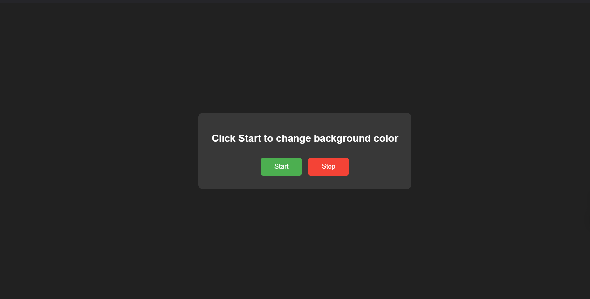

# Background Color Changer 🎨

A fun JavaScript project that changes the background color randomly at fixed intervals!

## Features ✨

- Random HEX color generation 🌈
- Start/Stop functionality 🎮
- Smooth color transitions 🔄

## How it Works 🛠️

The project uses the following JavaScript concepts:

- `setInterval()` for timed color changes
- DOM manipulation
- HEX color generation
- Event Listeners

## Usage 🚀

1. Click the "Start" button to begin color changes
2. Watch the background change every second!
3. Click "Stop" to pause the changes

## Code Concepts 📚

### SetInterval

The core functionality uses `setInterval()` which:

- Executes a function repeatedly
- Takes two parameters:
  - Callback function to execute
  - Time delay in milliseconds
- Can be stopped using `clearInterval()`

### Color Generation 🎨

- Uses hexadecimal characters (0-9, A-F)
- Generates a random 6-character code
- Prepends '#' to create valid HEX color

## Try It Out! 🎯

Open `index.html` in your browser and start clicking!

## Technologies Used 💻

- HTML
- CSS
- JavaScript

## Screenshot 📸

