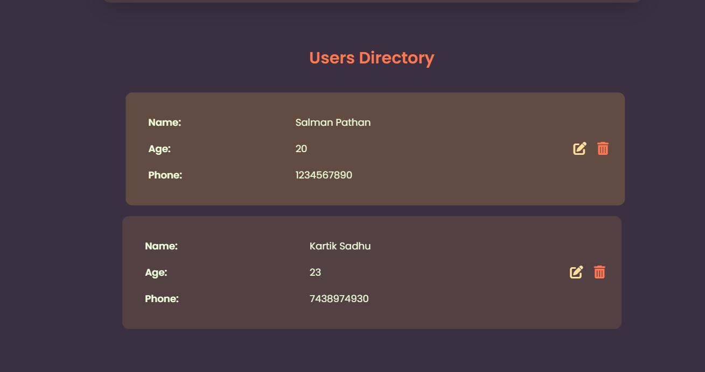

# Simple Form with Validation and Data Management

This is a simple web project that demonstrates a form with validation and data management. It allows users to input their Name, Age, and Phone Number, validate the inputs, and display the data below the form in a structured table format. Users can also edit or remove entries as needed.

---

## Features

- **Form Validation**: Ensures that all input fields are filled and valid before adding the data.
- **Data Display**: Displays added data in a clean, structured table format.
- **Edit Functionality**: Allows users to edit existing entries.
- **Remove Functionality**: Enables users to delete specific entries.
- **Responsive Design**: The layout is styled to look clean and professional.

---

## Validation Rules

- **Name**: Must not be empty.
- **Age**: Must be a positive number between 1 and 120.
- **Phone Number**: Must be a valid 10-digit number.

## Screenshots

### Form

### Data Section

---

## Technologies Used

- **HTML**: Structure of the form and data display.
- **CSS**: Styling for the form and table layout.
- **JavaScript**: Logic for validation, data management, and dynamic updates.

---
